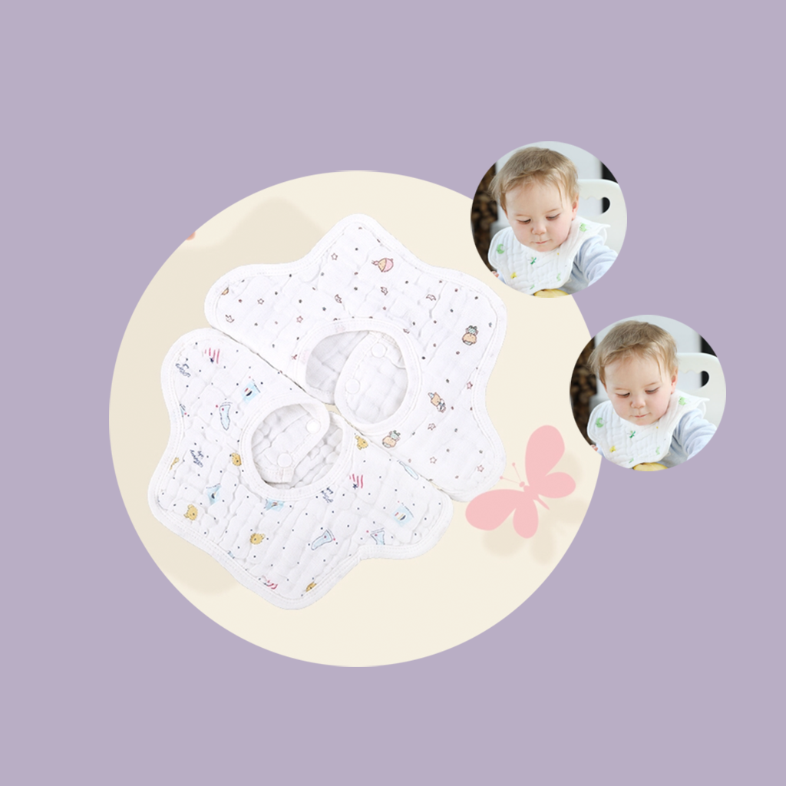

## Welcome to My Baby Daily Bib Usage Record

In daily life, babies often need to use bibs, for example, when they eat, they need to wear Bibs to prevent food from falling onto their clothes and soiling their clothes, or when they are prone to saliva or runny nose, they need to use Bibs to help their babies wipe off saliva and keep their babies clean. Baby's bib is easy to get dirty and grow bacteria. We should always replace and clean the bib. We can record the time, model, color and other details of baby's bib. In this way, we can more easily remember the time when the baby's bib needs to be replaced, and help the baby keep clean.

If you have any questions, you can either leave a message or send the questions to our email address.

We will answer them for you in the first time.

### Address: BeatriceArlenexSgPdE@yahoo.com

Thank you!
